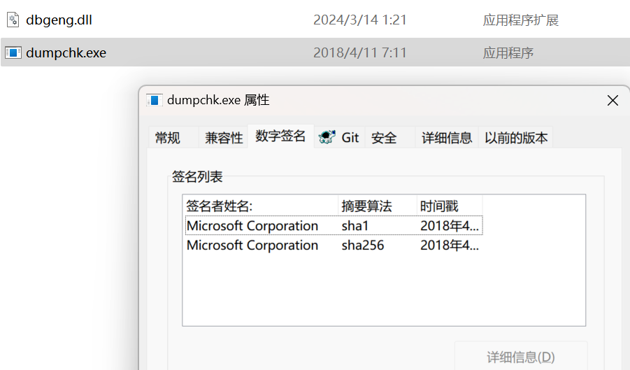
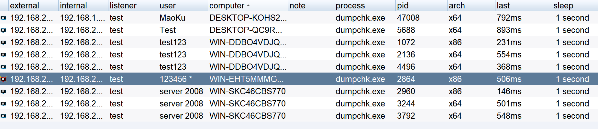

# DllMain Hijacking
 

Resolve the issue of DLLmain function in white and black DLLs hanging when calling shellcode

### 项目演示
https://github.com/jxust-xiaoxiong/DllMainHijacking/assets/26914648/67f7fff5-a369-4314-93f3-27fd29c1fe78

### 项目适配测试

- 在win11 64、win10 64、win7 64、win7 32、server 2008 64系统中测试静态，动态加载均测试上线CS成功

  

  
